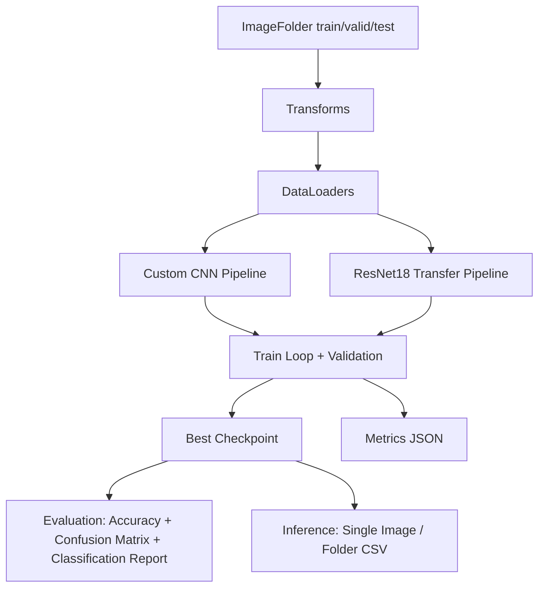

# Butterfly Image Classification

Production-style PyTorch repository for butterfly/moth species classification using:

- A custom 4-convolution CNN.
- Transfer learning with ResNet18 (ImageNet pretrained).

This project is designed for reproducibility, clean modularity, and practical MLOps-lite workflow (configs, checkpoints, metrics, CI, Docker).

## Dataset

Dataset source: [Kaggle - Butterfly Images 40 Species](https://www.kaggle.com/datasets/gpiosenka/butterfly-images40-species)

Do not commit dataset images into Git. Place data locally in:

```text
data/raw/butterfly-images40-species/
  train/<class_name>/*.jpg
  valid/<class_name>/*.jpg
  test/<class_name>/*.jpg
```

## Architecture Overview



## Quickstart

### 1) Setup environment

```bash
python -m venv .venv
source .venv/bin/activate
pip install --upgrade pip
pip install -r requirements.txt
```

Windows (PowerShell):

```powershell
python -m venv .venv
.venv\Scripts\Activate.ps1
pip install --upgrade pip
pip install -r requirements.txt
```

### 2) Run data sanity check

```bash
python -m src.data.sanity_check --config src/config/default.yaml
```

### 3) Train models

```bash
python -m src.train.train_cnn --config src/config/cnn.yaml
python -m src.train.train_resnet18 --config src/config/resnet18.yaml
```

### 4) Evaluate a checkpoint

```bash
python -m src.eval.evaluate --config src/config/resnet18.yaml --checkpoint outputs/models/resnet18/best.pt --split test
```

### 5) Inference

Single image:

```bash
python -m src.infer.predict --config src/config/resnet18.yaml --checkpoint outputs/models/resnet18/best.pt --image_path path/to/image.jpg --top_k 5
```

Folder mode:

```bash
python -m src.infer.predict --config src/config/resnet18.yaml --checkpoint outputs/models/resnet18/best.pt --image_dir path/to/images --top_k 5
```

## Entrypoints

- `python -m src.train.train_cnn --config src/config/cnn.yaml`
- `python -m src.train.train_resnet18 --config src/config/resnet18.yaml`
- `python -m src.eval.evaluate --config src/config/resnet18.yaml --checkpoint outputs/models/resnet18/best.pt --split test`
- `python -m src.infer.predict --config src/config/resnet18.yaml --checkpoint outputs/models/resnet18/best.pt --image_path path/to/image.jpg`

## Repository Structure

```text
.
├─ README.md
├─ docs/
├─ src/
├─ scripts/
├─ tests/
├─ requirements.txt
├─ Dockerfile
├─ .gitignore
└─ .github/workflows/ci.yml
```

## Results (Template)

| Pipeline | Val Accuracy | Test Accuracy | Notes |
|---|---:|---:|---|
| Custom CNN | - | - | Notebook reference test accuracy: ~0.726 |
| ResNet18 Transfer | - | - | Notebook reference test accuracy: ~0.930 |

## Outputs

- `outputs/models/<pipeline>/best.pt`
- `outputs/metrics/<pipeline>/metrics.json`
- `outputs/plots/*`
- `outputs/predictions/preds.csv`

## Roadmap

1. Add mixed precision + gradient accumulation.
2. Add learning-rate schedulers and early stopping.
3. Add experiment tracking (MLflow/W&B).
4. Add ONNX/TorchScript export and model serving API.
